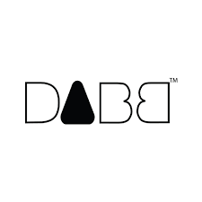

# Hey 👋, This is Shrimad Bhagwat

 

  

  &nbsp; I'm a Final year B.Tech. Computer Science student specializing in Gaming Technology at Vellore Institute of Technology, Bhopal.

- 🌱 I’m currently learning
  - Android Development 

---

<!-- Actual text -->

  
### You can find me on

<h3 align="center">

### Languages and Tools

</h3>

 
 
 
 

 
  

  

 

 

 

